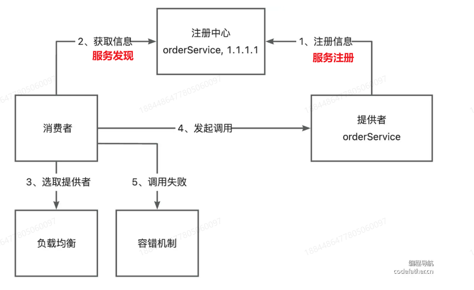

# wb-rpc 自定义协议的可扩展 RPC 框架
## 1. 一个简易版RPC框架开发
> 1. [手写 RPC 框架项目教程 - 编程导航教程](https://www.codefather.cn/course/1768543954720022530/section/1768545847093518337?contentType=text&tabKey=list&type=#)
> 2. [手写 RPC 框架 - 个人笔记+梳理+总结+扩展点实现（作者：Jools_Wakoo）](https://www.codefather.cn/post/1886747157767315457#heading-126)
### 1.1 基本设计


### 1.2 扩展设计



### 1.3 RPC框架与Feign的区别和联系

> 1. [Spring Cloud OpenFeign](https://docs.spring.io/spring-cloud-openfeign/docs/current/reference/html/#spring-cloud-feign)
> 2. [为什么 Feign 要用 HTTP 而不是 RPC？](https://blog.csdn.net/jam_yin/article/details/142371004)

**主要区别：**
Feign是基于HTTP实现的框架，而RPC框架是可以基于TCP/HTTP实现的框架，
RPC框架可以使用TCP作为网络协议来提高传输通讯性能，这是Feign做不到的。
Feign 选择使用 HTTP 而不是 RPC 是有其合理性的。
HTTP 具有通用性、兼容性、跨语言跨平台性、可扩展性、灵活性、安全性以及丰富的生态系统和工具支持等优势，
适合在多语言环境、快速开发与迭代、对通用性和兼容性要求高的场景下使用。
而 RPC 则具有高效性、强类型接口和丰富的功能等优势，适合在高性能要求、强类型接口需求和复杂业务逻辑场景下使用。
在实际应用中，开发者应根据项目的具体需求和特点，选择合适的服务通信方式，以实现高效、可靠的微服务架构。

**关系：**
Feign和PRC框架都高度依赖**代理模式**，
所以是可以在不改变原来的接口和实现类的情况下，创建一个新的接口类来决定哪些接口可以被简单地直接调用。
这对于把单体架构重构为微服务架构来说意义重大，可以让这个过程不再繁琐。

**总结：**

| 特性             | Feign                                          | RPC 框架 (如 Dubbo, gRPC)                      |
| :--------------- | :--------------------------------------------- | :--------------------------------------------- |
| **本质**         | **声明式 HTTP 客户端库**                       | **远程过程调用框架**                           |
| **核心协议**     | HTTP (通常 RESTful)                            | 灵活 (TCP/HTTP/自定义二进制, gRPC-HTTP/2等)    |
| **序列化**       | 通常文本 (JSON/XML)                            | 通常高性能二进制 (Protobuf, Thrift, Hessian等) |
| **服务治理**     | 依赖外部组件 (Ribbon, Eureka, Hystrix等)       | **通常内置** (服务发现, LB, 熔断, 监控等)      |
| **接口定义**     | Java Interface + HTTP 注解                     | IDL (如 .proto) 或严格 Java Interface          |
| **透明调用实现** | **动态代理 (运行时生成)**                      | **代理/Stub (通常编译时或运行时生成)**         |
| **适用场景**     | 跨语言/简单 HTTP API 调用, 微服务 RESTful 集成 | 高性能内部服务调用, 强治理需求, 复杂通信模型   |


### 1.4  其他设计

除了上面几个经典设计外，如果想要做一个优秀的 RPC 框架，还要考虑很多问题。
比如：

- 服务提供者下线了怎么办？需要一个失效节点剔除机制。
- 服务消费者每次都从注册中心拉取信息，性能会不会很差？可以使用缓存来优化性能。
- 如何优化 RPC 框架的传输通讯性能？比如选择合适的网络框架、自定义协议头、节约传输体积等。
- 如何让整个框架更利于扩展？比如使用 Java 的 SPI 机制、配置化等等。
  

在这个项目中，都会把这些问题解决。但是实际上做个完美的RPC项目需要解决的问题还有更多，这里不做讨论。

## 2. 全局配置加载

### 2.1 基本设计

通过双检索单例模式支持`application.properties`文件中的属性懒加载，支持以下属性：

- name 名称
- version 版本号
- serverHost 服务器主机名
- serverPort 服务器端口号

通过在`application.properties`文件中导入属性：

```properties
rpc.name=wbrpc
rpc.version=3.0
rpc.serverPort=8082
```

### 2.2 扩展设计

## 3. 接口Mock

### 3.1 基本设计

目前能让所有的接口得到对应的Mock，只是这些采取的是简单默认值，比如`int`的默认值是0，所有对象的默认值为null。

### 3.2 扩展设计

## 4. 序列化器与SPI机制

### 4.1 基本设计

能够通过简单的配置直接选用序列化器：修改消费者和生产者示例项目中的配置文件（注意此时生产者使用的是`rpc-core`的配置文件)，指定**相同的**序列化器，比如 `hessian`：

```Properties
rpc.serializer=hessian
```

然后依次启动生产者和消费者，发现能够正常完成RPC请求和响应。

### 4.2 扩展设计


## 5. 注册中心基本实现

### 5.1 基本设计

已经可以先让服务提供者将服务地址等信息注册到注册中心，然后消费者通过服务发现从注册中心获取到这些信息。

通过实现这个过程，可以发现，实际上这种代理模式，本质上通过**同一个接口名（都来源于公共模块）**来传递实例对象：消费者将接口名放到请求体中，而**提供者在服务器启动前将<接口名: 实例>放到本地注册中心中**，然后在服务启动后通过请求处理器来获取这些实例。也就是说，推测服务提供者是必须用到公共模块的接口的，只是这一步代码我在用其他框架比如 Feign 时，都是自动处理好了，所以显得我并没有手动在一个java文件中导入并编写公共模块的接口。

当然，这并不违反代理模式的设计理念，解释如下：

在已有接口类以及对应的业务实现类中（比如service层的java类）需要更改：

- java实现类中import的POJO对象。

而在使用了本地注册中心（比如`LocalRegistry`）的用于专门启动某些配置的类中（比如`PrividerExample`)，需要更改：

- java实现类中import的POJO对象。
- java实现类中import的接口全类名。

以上都是**不需要变更已有的接口类和实现类中的内容**，只需要变更导入的方式，这就是代理模式的好处。

### 5.2 扩展设计


## 6. 注册中心优化

### 6.1 基本设计

成功实现 3 个注册中心的优化点：

1. 心跳检测和续期机制

2. 服务节点下线机制

3. 消费端服务缓存

   

4. 基于 ZooKeeper 的注册中心实现（出现一些错误，待解决）

### 6.2 扩展设计


## 7. 自定义协议
### 7.1 基本设计
采用TCP协议完成网络传输，并设计消息结构设计如下：

通过**装饰者模式**来使用`RecordParser`对原有的 Buffer 处理器的能力进行增强，成功解决粘包和半包的问题。

### 7.2 扩展设计


## 8. 负载均衡

### 8.1 基本设计

在服务发现方法中，成功实现负载均衡算法中的：

1. 轮询（Round Robin)
2. 随机（Random）
3. 一致性哈希（Consistent Hashing）


使用轮询算法时，因为线程安全问题，所以使用的线程安全的原子类`AtomicInteger`。

### 8.2 扩展设计

#### 1）基于公平读写锁+双重检测锁 实现`setIfChangedAndGet`操作来保证一致性哈希算法的线程安全

##### 需求分析

为了确保 `ConsistentHashLoadBalancer` 的线程安全性，我们需要解决以下问题：

1. `TreeMap` 非线程安全，多线程并发修改会导致数据不一致。
2. 每次 `select()` 调用都会重建整个哈希环，效率低下且非必要。

##### 设计方案

1. **读写锁 (ReadWriteLock) 机制**：
   - 使用 `ReentrantReadWriteLock` 分离读/写操作。
   
   - 写锁：保护哈希环的重建过程（独占访问）。
   
   - 读锁：保护哈希环的查询操作（并发访问）。
   
2. **服务列表变更检测：**
   - 通过`hasServiceListChanged()`方法检测服务列表变化。该方法的最坏时间复杂度为O(n+m)，空间复杂度为O(n+m)。其中n和m分别为这两个列表的长度。
   
   - 比较服务地址哈希集合而非直接比较对象引用。
   
   - 避免不必要的哈希环重建。
   
3. **双重检查锁定：**

   - 获取写锁前先进行无锁检查。

   - 获取写锁后再次验证变更状态。
   - 避免不必要的锁竞争。

##### 开发实现

参考本次Fix提交中的`ConsistentHashLoadBalancer.java`文件。
通过定义并实现扩展接口`LoadBalancerForHash`的方式在不破坏其他实现类的情况下进行功能的扩展。

##### 测试
测试时又仔细看了下逻辑，发现`ConsistentHashLoadBalancer`类是线程安全的，
但是实际上**使用该类的类并不能完全说是线程安全**（和使用线程安全类`ConcurrentSkipListMap`一样），可能会存在一种几乎不会发生的情况：
线程1获取读锁前被卡住（相当于`Thread.sleep()`）并直到线程2获取写锁写完并且比线程1早一步获取到读锁才继续，
此时线程1获得的哈希环是可能更改过了的。但这种情况一般不会发生，原因如下：

- 获取写锁前执行`hasServiceListChanged()`方法进行检测需要时间。
- 这是公平的读写锁，只要线程1先执行获取锁的语句，就能在队列中优先获取到读锁。
- 节点的变更一般不会很频繁，大多时候都是只有并发读取。对一个进程来说，一个节点的变更一般只要生成一次新的哈希环。
也就是说只要一个线程获取写锁并更新一次类的静态实例（即负载均衡这个实例）中的哈希环，所以其他线程就不用再获取写锁来更新了，然后所有线程又会回归并发读取这种常态。


**最重要的是**，哪怕是失败了比如访问了挂掉的节点，也会有重试机制和容错机制（后几章会实现），所以其实这里不用太严格。
但是也不能直接不管，可以warn一下：
```java
if (hasServiceListChanged(serviceMetaInfoList)) {
    log.warn("此时的服务列表已经发生变化");
    //throw new RuntimeException("此时的服务列表已经发生变化");
}
```
如果要**完全解决这个问题**的话，可以不采用单例模式加载类`ConsistentHashLoadBalancer`
或者`setIfChanged`方法返回一个完整的深拷贝的哈希环并将其作为形参传入`select`方法中,但是这样消耗的内存会很多，
所以综合考量下，使用现在这种方法是最好的。


## 9. 重试机制

### 9.1. 基本设计

基于Gu⁠ava-Retrying 库实现重试时间算法（重试策略）如下：

1. 不重试。
2. 固定重试间隔（Fixed Retry In⁠terval）。


### 9.2. 扩展设计

